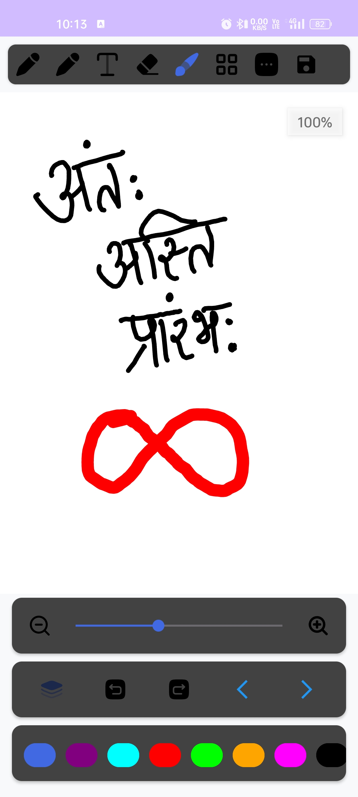

# GS_V1: Your Drawing And Note Taking App

GS_V1 is a versatile and feature-rich drawing application for Android devices, designed to empower artists, note-takers, and creators alike. With an intuitive interface, a wide array of tools, and advanced functionalities like layer management and multi-page support, GS_V1 offers a seamless creative experience. Whether you're sketching a masterpiece, annotating a document, or brainstorming ideas, GS_V1 has you covered with tools like pen, pencil, eraser, and text, plus the ability to export your work as images or PDFs.

## Features

- **Multiple Tools:** Choose from Pen, Pencil, Eraser, Text, and Brush to create with precision and style.
- **Layer Management:** Add, remove, and switch between layers to organize your artwork effortlessly.
- **Zoom and Pan:** Smooth zooming (50%-300%) and two-finger panning for detailed work.
- **Color Palette:** Select from predefined colors or use the custom color picker for endless possibilities.
- **Undo/Redo:** Easily correct mistakes with unlimited undo and redo actions.
- **Grid Toggle:** Enable an optional grid for alignment and precision.
- **Multi-page Support:** Work across multiple pages and navigate seamlessly between them.
- **Export Options:** Save your drawings as high-quality images (WEBP) or multi-page PDFs.
- **Share Functionality:** Share your creations directly from the app with a thumbnail preview.

## Screenshots

Here’s a glimpse of GS_V1 in action (replace placeholders with actual screenshots):

- **Main Drawing Interface**  
  

- **Tool Selection**  
  

- **Layer Management**  
  

- **Zoom and Pan**  
  

## Installation

### Pre-built APK
To install GS_V1 on your Android device:

1. Download the latest APK from the [releases page](https://github.com/sitendernarwal/GS_V1/releases).
2. On your device, go to **Settings > Security** and enable **Install from Unknown Sources**.
3. Open the downloaded APK file and follow the on-screen instructions to install.

### Build from Source
To build and run GS_V1 yourself:

1. Clone the repository:
   ```
   git clone https://github.com/sitendernarwal/GS_V1.git
   ```
2. Open the project in **Android Studio**.
3. Connect an Android device or start an emulator.
4. Click **Build > Build Bundle(s) / APK(s) > Build APK** or **Run > Run 'app'** to install it on your device.

## Usage

### Tools
- **Pen:** Draw smooth, rounded strokes—perfect for outlines.
- **Pencil:** Create textured, sketch-like lines with a unique style.
- **Eraser:** Remove unwanted parts of your drawing (double-tap to clear the canvas).
- **Text:** Add customizable text with adjustable size and color (double-tap to delete).
- **Brush:** Adjust the size for varied stroke widths via a handy dialog.

Select a tool by tapping its icon in the toolbar at the top.

### Layers
- Tap the **Layers** button to open the layer management dialog.
- Add new layers with a custom name (e.g., "Layer 2").
- Switch between layers by tapping them in the list.
- Long-press a layer to delete it (minimum one layer required).

### Zoom and Pan
- Use the **Zoom In** (+) and **Zoom Out** (-) buttons to adjust the canvas size (50%-300%).
- Fine-tune zoom with the **Zoom SeekBar** for precise control.
- Pan the canvas by dragging with two fingers.

### Color Selection
- Pick from the predefined colors in the bottom palette (e.g., Blue, Red, Black).
- Tap the **+** button to open the custom color picker with 18 vibrant options.

### Undo/Redo
- Tap the **Undo** button to revert your last action.
- Tap the **Redo** button to restore an undone action.

### Grid
- Toggle the grid on/off with the **Grid** button for alignment assistance.
- Adjust grid size in **Settings > Grid Size** (Small, Medium, Large, or Off).

### Multi-page Support
- Use the **Previous** and **Next** buttons to navigate between pages.
- Add a new page by tapping **Next** when on the last page—your current page is saved automatically.

### Export and Share
- Open the **Menu** (three-dot icon) to:
  - Export the current page as an image (saved to Pictures).
  - Export all pages as a PDF (saved to Documents).
- Tap the **Share** button to send a thumbnail of your current drawing via email, messaging, etc.

### Settings
- Access **Settings** from the menu to:
  - Change the canvas background color.
  - Set the default brush size.
  - Adjust the grid size.

## Contributing

We’d love your help to make GS_V1 even better! To contribute:

1. Fork the repository on GitHub.
2. Create a new branch for your feature or bug fix:
   ```
   git checkout -b feature/your-feature-name
   ```
3. Commit your changes with clear, descriptive messages:
   ```
   git commit -m "Add feature: your feature description"
   ```
4. Push your branch:
   ```
   git push origin feature/your-feature-name
   ```
5. Open a pull request on the [GitHub repository](https://github.com/sitendernarwal/GS_V1).

Please ensure your code adheres to the project’s coding standards and includes relevant tests where applicable.

## License

This project is licensed under the MIT License. See the [LICENSE](LICENSE) file for details.

## Contact

For support, feedback, or questions, feel free to:
- Reach out to [sitendernarwal](https://github.com/sitendernarwal).
- Open an issue on the [GitHub repository](https://github.com/sitendernarwal/GS_V1).
